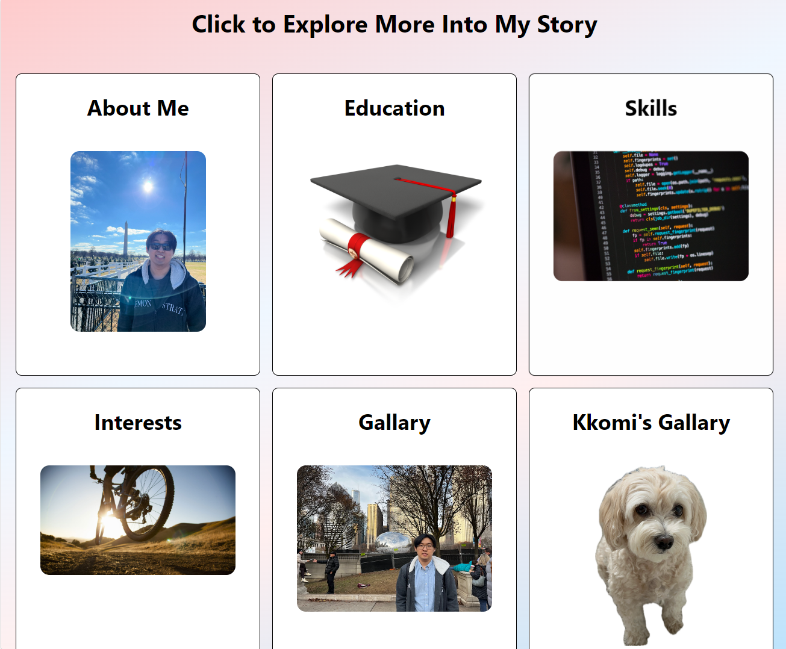
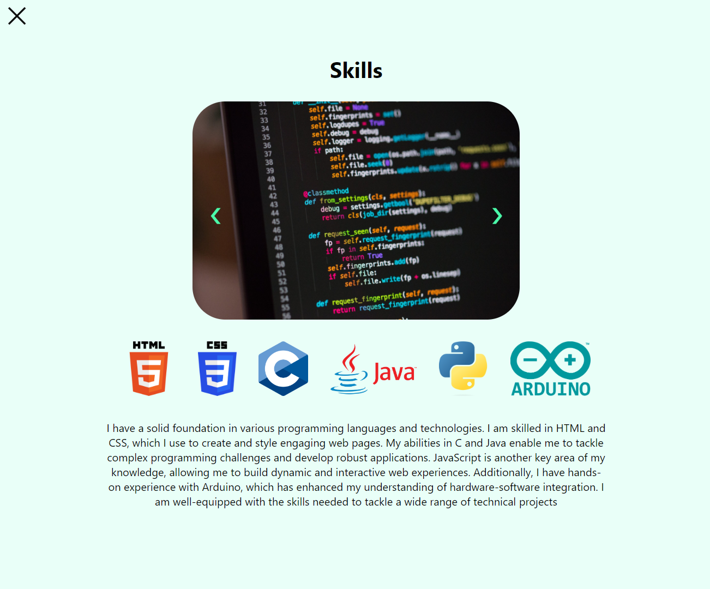
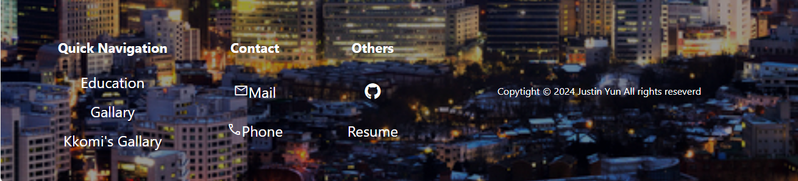
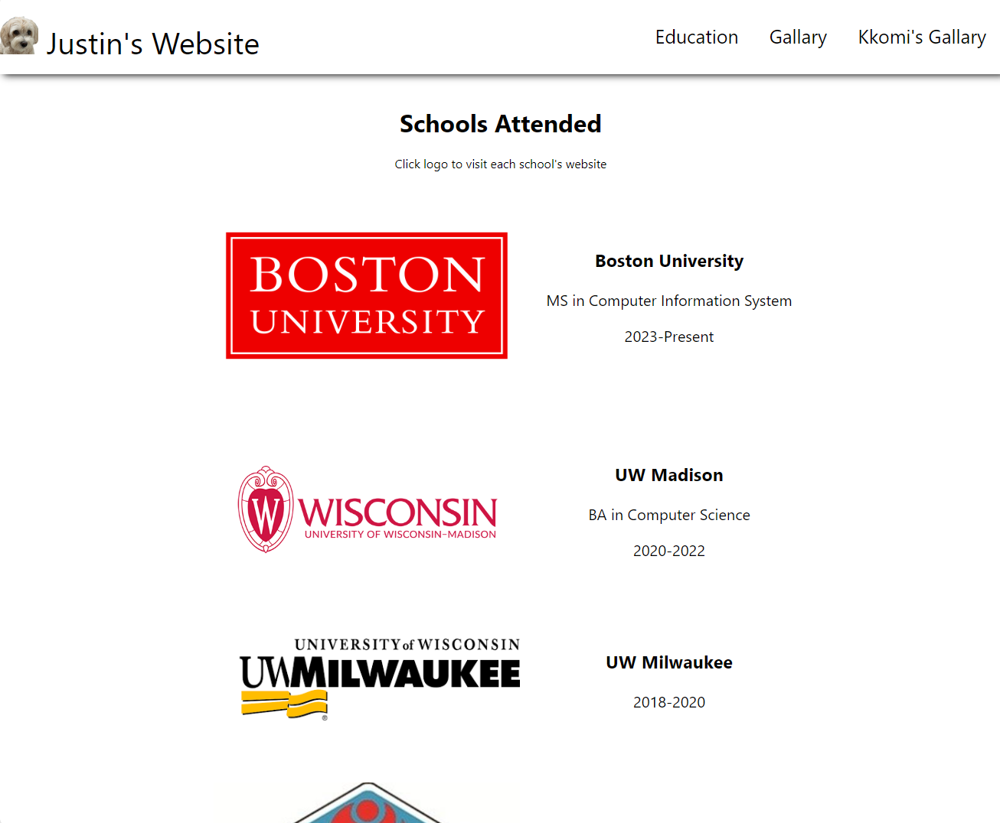
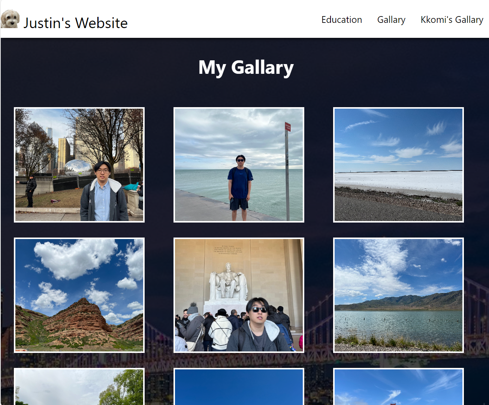
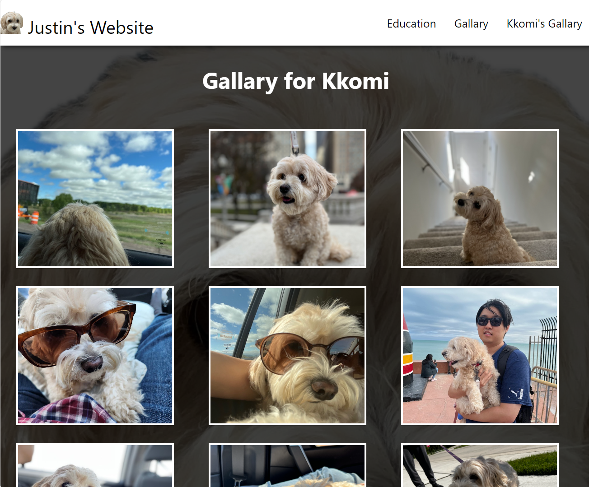

# **MET CS601: Final Term Project**
This is a README.md - summary for Final Term Project.

This webpage is built by React Application. Below is a summary of the project structure and its components.

## App.js
Root component of the React Application. It integrates four main pages:
+ Homepage
+  Education 
+ Gallary 
+  KkomiGallary

## Homepage.js / Homepage.css
Functional component in the React application that serves as the main landing page. It has 4 sub-components.

+ Header.js / Header.css
+ Welcome.js / Welcome.css
+ Mainpage.js / Mainpage.css
> In the mainpage, there are items displyed as a grid. Some items have button link to otehr components: Education, Gallary and KkomiGallry.
+ Footer.js / Footer.css
> It contains my resume, my Github link.

## Education.js / Education.css
A component shows educational background information.

## Gallary.js / Gallary.css
A gallery component displaying my travel photos in a grid layout.

## KkomiGallary.js / KkomiGallary.css
A gallery component featuring photos of my dog, also arranged in a grid layout.

## Screenshots
### Header and Welcome Image 

### Mainpage Image 

> If you click item, you can see this kind of page
>
>

### Footer Image

### Education Image

### Gallary Image

### KkomiGallary Image

